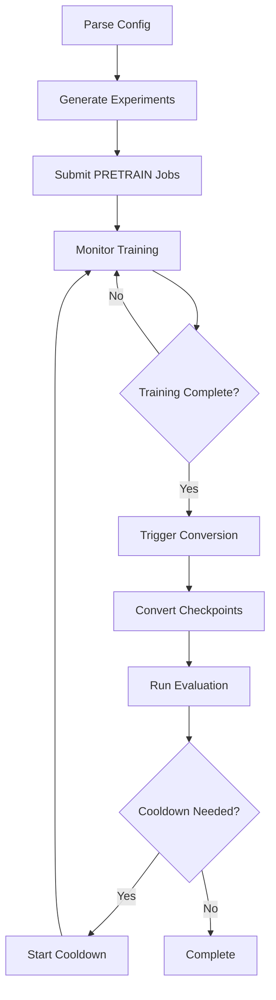

# MegatronLM with AutoExperiment: Automated Scaling Experiments

## Overview

This guide documents the integration of [AutoExperiment](https://github.com/SLAMPAI/autoexperiment) with MegatronLM for automated large-scale language model training experiments. The system orchestrates complex multi-phase training workflows including pretraining, cooldown phases, checkpoint conversion, and evaluation - all managed through declarative YAML configurations.

## System Architecture

### Core Components

1. **AutoExperiment**: Orchestration framework that manages job scheduling, monitoring, and workflow execution
2. **MegatronLM**: Distributed training framework for large language models
3. **Slurm**: Job scheduler for HPC cluster management
4. **Helper Scripts**: Auxiliary scripts for checkpoint management and conversion monitoring

### Key Features

- **Automated Multi-Phase Training**: Supports pretraining and cooldown phases with different hyperparameters
- **Dynamic Checkpoint Conversion**: Automatically converts Megatron checkpoints to HuggingFace format
- **Continuous Evaluation**: Runs evaluation benchmarks on converted checkpoints
- **Parallel Experiment Management**: Handles multiple model sizes and hyperparameter configurations simultaneously
- **Fault Tolerance**: Includes checkpoint tracking and resume capabilities

## Configuration Structure

### Main Configuration File: `scaling_exps.yaml`

The primary configuration file defines the entire experimental setup using a hierarchical structure:

```yaml
# Job scheduling parameters
cmd: "sbatch {sbatch_script}"
check_interval_secs: 600

# Cluster configuration
PARTITION: booster
ACCOUNT: projectnucleus
TIME: 360
NODES: 1

# Experiment definitions
EXPERIMENTS:
  - 10M:
      NUM_LAYERS: 5
      HIDDEN_SIZE: 160
      NUM_ATTN_HEADS: 4
  - 25M:
      NUM_LAYERS: 9
      HIDDEN_SIZE: 288
      NUM_ATTN_HEADS: 4
  # ... more model sizes
```

### Key Configuration Sections

#### 1. **Model Architecture** (`EXPERIMENTS`)
Defines multiple model sizes with their architectural parameters:
- Number of layers, hidden size, attention heads
- FFN hidden size (typically 4x hidden size)
- Model naming convention

#### 2. **Training Hyperparameters**
- Learning rates with sweep capabilities: `[1e-2, 5e-3, 1e-3, 5e-4, 1e-4]`
- Weight decay coupled to LR: `LR*WD = 1e-4`
- Batch sizes: `[4, 16, 32]` with automatic global batch calculation
- Warmup iterations based on model size and batch size

#### 3. **Phase Management** (`PHASE`)
Two-phase training approach:
- **PRETRAIN**: Main training phase with WSD (Warm Start Decay) schedule
- **COOLDOWN**: Additional training with extended decay for improved performance

#### 4. **Mode Operations** (`MODE`)
Each phase supports multiple operational modes:
- **TRAIN**: Actual model training
- **CONVERT_EVAL**: Checkpoint conversion and evaluation

## Helper Scripts

### 1. `convert_helper.sh`
Monitors checkpoint directories and identifies unconverted checkpoints ready for processing.

**Key Functions:**
- Scans checkpoint directories for completed checkpoints
- Tracks conversion status using marker files
- Prevents duplicate conversions with lock files
- Returns count of pending conversions

**Usage:**
```bash
./convert_helper.sh <RUN_DIR> [MIN_ITER]
```

### 2. `cooldown_helper.sh`
Manages checkpoint discovery and symlink creation for cooldown phase initialization.

**Key Functions:**
- Finds appropriate checkpoint from pretraining phase
- Creates symbolic links for cooldown initialization
- Updates latest checkpoint iteration markers

**Usage:**
```bash
./cooldown_helper.sh <LOGS> <EXP_NAME> <ITER> <CD_SCALE>
```

### 3. `train_container_simple.sh`
SBATCH template for training jobs with containerized execution.

**Features:**
- Configures distributed training environment
- Sets up NCCL parameters for multi-node communication
- Manages checkpoint paths and tensorboard logging
- Handles container execution with Singularity/Apptainer

### 4. `convert_eval_checkpoint.sh`
SBATCH template for checkpoint conversion and evaluation.

**Features:**
- Converts Megatron checkpoints to HuggingFace format
- Processes ALL unconverted checkpoints in sequence
- Runs evaluation benchmarks on converted models
- Maintains conversion tracking state

## Workflow Execution

### 1. Experiment Generation
AutoExperiment expands the configuration to create all experiment combinations. For example:
```
MODEL × LR × BATCH_SIZE × BIAS_SETTING × PHASE × MODE
```

### 2. Job Submission Flow



### 3. Checkpoint Management

The system maintains three tracking directories:
- `checkpoints/`: Raw Megatron checkpoints
- `converted_checkpoints/`: Marker files for completed conversions
- `in_progress_checkpoints/`: Lock files for ongoing conversions

### 4. Automatic Triggering

**Start Conditions:**
- Training jobs start immediately upon submission
- Conversion jobs use `start_condition_cmd` to check for unconverted checkpoints
- Cooldown jobs wait for specific checkpoint iterations

**Termination Conditions:**
- Training: Checks for "after training is done" in logs
- Conversion: Monitors both conversion completion and training status

## Advanced Features

### Dynamic Expression Evaluation
The configuration supports computed values using `expr()`:
```yaml
GLOBAL_BATCH_SIZE: "expr(int(({NUM_GPUS} * {MICRO_BATCH_SIZE} * {GAS})/{TP}))"
LR_WARMUP_ITERS: "expr(min(2*(12*({HIDDEN_SIZE}**2)*{NUM_LAYERS} + {HIDDEN_SIZE}*{VOCAB_SIZE}) // ({SEQ_LENGTH} * {GLOBAL_BATCH_SIZE}), 5000))"
```

### Multi-Scale Cooldown
Supports multiple cooldown durations as percentage of total tokens:
```yaml
CD_SCALE:
  - 100M: {TOTAL_TOKENS_THIS_PHASE: 100_000_000}
  - 200M: {TOTAL_TOKENS_THIS_PHASE: 200_000_000}
  - 1B: {TOTAL_TOKENS_THIS_PHASE: 1_000_000_000}
```

### Bias Experimentation
Tests models with and without bias terms:
```yaml
BIAS:
  - WITH: {DISABLE_BIAS_LINEAR: "", BIAS_NAME: "with"}
  - WITHOUT: {DISABLE_BIAS_LINEAR: "--disable-bias-linear", BIAS_NAME: "without"}
```

## Usage Example

### 1. Prepare Configuration
Edit `scaling_exps.yaml` to define your experiments:
```yaml
EXPERIMENTS:
  - 50M:
      NUM_LAYERS: 12
      HIDDEN_SIZE: 384
      NUM_ATTN_HEADS: 6
```

### 2. Set Training Parameters
Configure hyperparameters:
```yaml
LR: [1e-3, 5e-4]
MICRO_BATCH_SIZE: [16, 32]
TOTAL_TOKENS_NUM: 2_000_000_000
```

### 3. Launch AutoExperiment
```bash
autoexperiment build-and-run scaling_exps.yaml
```

### 4. Monitor Progress
AutoExperiment will:
- Submit all training jobs
- Monitor completion status
- Trigger conversions automatically
- Launch cooldown phases when ready
- Generate evaluation results

## Output Structure

```
LOGS/
├── <DATASET>_<MODEL>_lr<LR>_b1_<BETA1>_b2_<BETA2>_wd<WD>_w<WARMUP>_n<NODES>_bs<BS>__<BIAS>Bias/
│   ├── checkpoints/
│   │   ├── iter_0000100/
│   │   ├── iter_0000200/
│   │   └── latest_checkpointed_iteration.txt
│   ├── converted_hf/
│   │   ├── iter_100/
│   │   └── iter_200/
│   ├── eval_results/
│   │   ├── iter_100/results.json
│   │   └── iter_200/results.json
│   ├── tensorboard/
│   ├── converted_checkpoints/
│   │   ├── iter_100.done
│   │   └── iter_200.done
│   └── cooldown_s<SCALE>/
│       ├── checkpoints/
│       ├── converted_hf/
│       └── eval_results/
```

## Troubleshooting

### Common Issues

1. **Checkpoints Not Converting**
   - Verify checkpoint completeness (check for `model_optim_rng.pt`)
   - Ensure tracking directories have write permissions
   - Check SBATCH output logs for errors

2. **Jobs Not Starting**
   - Verify `start_condition_cmd` returns expected values
   - Check Slurm queue and resource availability
   - Ensure helper scripts are executable

3. **Evaluation Failures**
   - Confirm HuggingFace model files copied correctly
   - Verify tokenizer compatibility

4. **Cooldown Phase Issues**
   - Ensure checkpoint iteration matches expected format
   - Verify symlink creation permissions
   - Check checkpoint path resolution

## Advanced Customization

### Adding New Model Architectures
1. Define architecture in `EXPERIMENTS` section
2. Update `CONVERSION` parameters if needed
3. Modify HuggingFace config template in conversion script

### Custom Evaluation Tasks
1. Place evaluation configs in `TASKS_PATH`
2. Update `--tasks` parameter in evaluation command
3. Modify output parsing if needed

### Multi-Dataset Training
Extend `DATASET` configuration:
```yaml
DATASET:
  - C4: {DATA_PATH: "...", DATASET_NAME: "c4"}
  - PILE: {DATA_PATH: "...", DATASET_NAME: "pile"}
```
